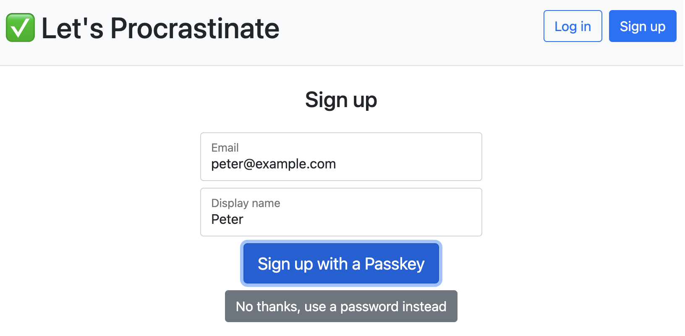

# Let's Procrastinate | Chapter 2: `Passkey-only Enrollment`

> The story of how a simple website went from using only passwords to deploying passkeys.

Baby steps. In the previous chapter, we made it easy for an existing, password-based user to make the jump to passkeys. But there will be _some_ adventurous souls out there who won't want to deal with a password at all. In this chapter we allow a user to create an account with only a passkey:



Oh, but we're not quite done yet!

What if a user wants to enroll multiple passkeys or remove a passkey? We'll cover that in the [**➡️ next (and final) chapter**](https://github.com/twistedstream/lets-procrastinate/tree/3_passkey-management) of our passkey story:

```shell
git checkout 3_passkey-management
```

## Setup

There's nothing new to install for this chapter. You just need the code changes that applied when you checked out the branch.

## Run

```shell
npm run dev
```
