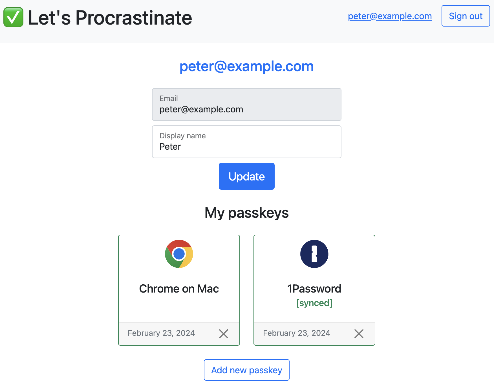

# Let's Procrastinate | Chapter 3: `Passkey Management`

> The story of how a simple website went from using only passwords to deploying passkeys.

Congratulations! You've made it to the final chapter of our passkey story.

Now that we've enabled existing users to register a passkey and new users to register an account with only a passkey, we need to provide a way to manage all these passkeys. This involves a simple update to the Profile page where the user can view, add, and remove their passkeys:



## Setup

No extra setup for this chapter.

## Run

```shell
npm run dev
```
