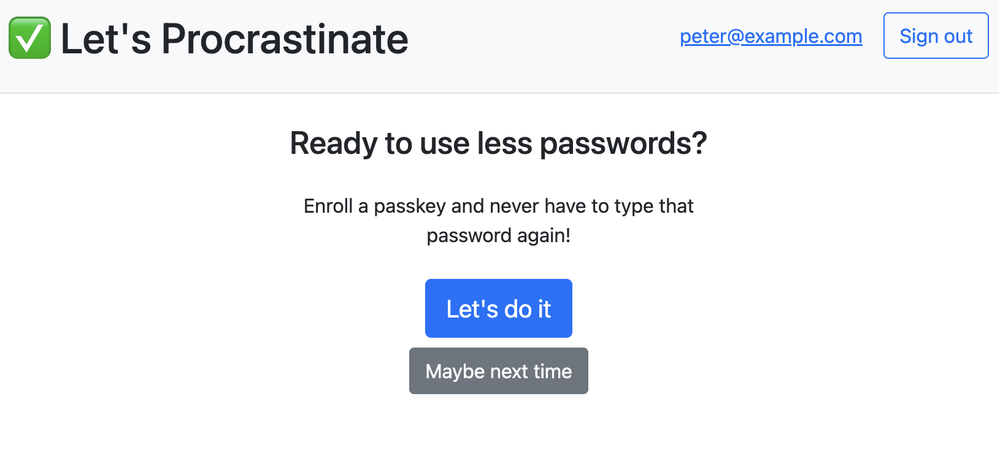
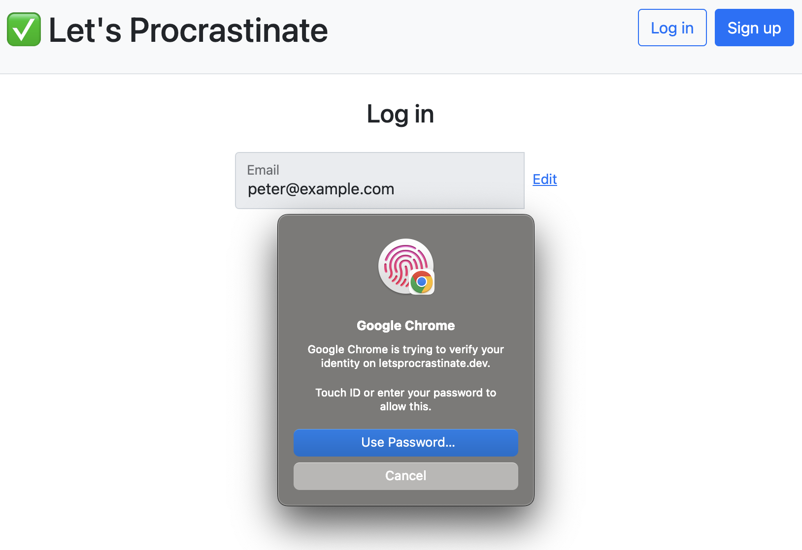
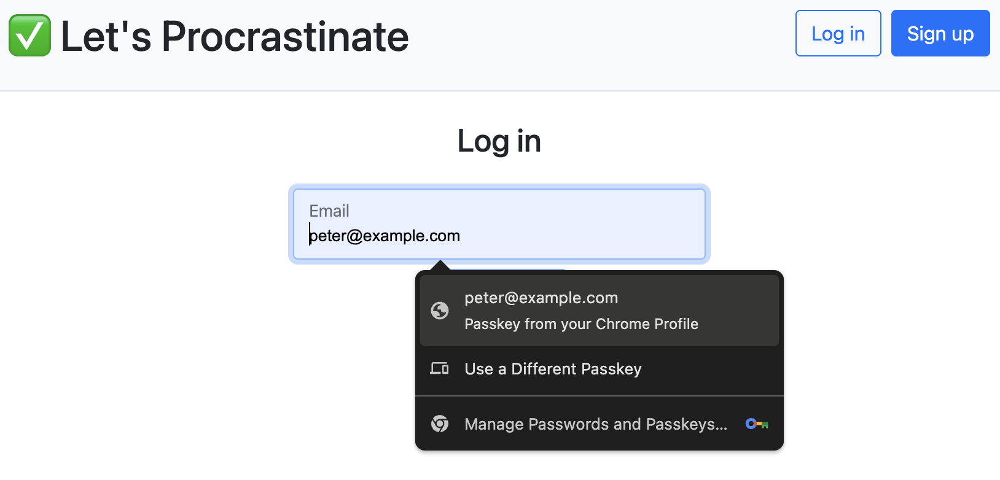

# Let's Procrastinate | Chapter 1: `Offering Passkeys`

> The story of how a simple website went from using only passwords to deploying passkeys.

Alright! We're finally enabling passkeys!

With this version of the sample, once they've signed in with their password, we're politely prompting the user if they want to "go passwordless" by enrolling a FIDO2 passkey:



Then, the next time they sign in, they can use their passkey _instead_ of their password:



Here are some other changes you may notice in this chapter:

- The login page was transformed from the more classic username/password prompt to an identifier-first flow where the username is collected in the first prompt and the credential in the next. This design provides more flexibility when the user has more then one way to authenticate.
- There is a new database table called `credentials` where passkey information is stored. Unlike a password, which usually has a 1-to-1 relationship with the user, a given user can enroll _multiple_ passkeys. This will become more important in a later chapter.
- While tons of low-level support for passkeys is baked into most modern browsers (via the [WebAuthn API](https://developer.mozilla.org/en-US/docs/Web/API/Web_Authentication_API)) there are still some gaps in the required frontend code. The sample uses the [@simplewebauthn/browser](https://simplewebauthn.dev/docs/packages/browser) library to help with this.
- FIDO2 also requires that you have a backend that serves up four JSON endpoints (`/attestation/option`, `/attestation/result`, `/assertion/options`, and `/assertion/result`). To assist with this, the sample leverages the [@simplewebauthn/server](https://simplewebauthn.dev/docs/packages/server) NPM package.
- The FIDO2 WebAuthn API now has support for authentication without even typing a username! The behavior is sort of like what happens with a password manager. We call this "passkey autofill" but its more commonly known as [Conditional UI](https://passkeys.dev/docs/use-cases/bootstrapping/). Check it out by setting the [`PASSKEY_AUTOFILL_ENABLED`](./CONFIG.md#passkey_autofill_enabled) environment variable to `true`.



Ready for more? Once you've got this working, check out the [**➡️ next chapter**](https://github.com/twistedstream/lets-procrastinate/tree/2_passkey-only-enrollment) where we allow users to create passkey-only accounts:

```shell
git checkout 2_passkey-only-enrollment
```

## Setup

### Database

There are a few schema changes we need to apply before this version of the sample will work:

```shell
npm run schema:apply
```

You can also perform a dry run without actually changing the spreadsheet:

```shell
npm run schema:apply:dry-run
```

### Dependencies

Install the dependency updates:

```shell
npm install
```

## Run

Now we're ready to run the sample again.

```shell
npm run dev
```
